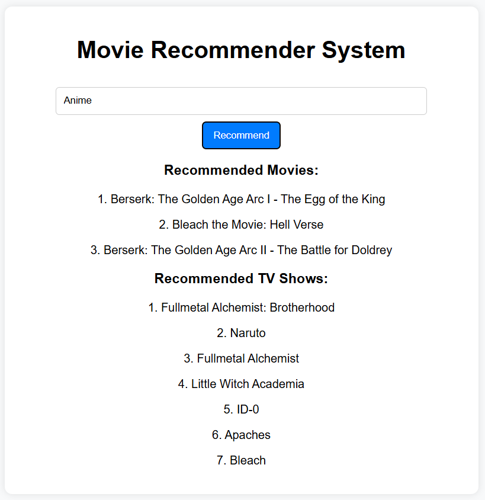

# Movie Recommendation System

A content-based movie and TV show recommendation system built using TF-IDF vectorization and cosine similarity.



## 📌 Features
- Recommend movies and TV shows based on a given title.
- Utilizes `TfidfVectorizer` for feature extraction.
- Calculates similarity using cosine similarity.
- API endpoint for fetching recommendations.
- Web interface for user interaction.

## 🛠️ Technologies Used
- Python
- Flask
- Scikit-learn
- Pandas
- NumPy
- HTML, CSS, JavaScript

## 📂 Dataset
The dataset used consists of movie and TV show metadata, including titles, genres, and descriptions.

## 🚀 How It Works
1. **TF-IDF Vectorization**: Transforms text data into numerical form.
2. **Cosine Similarity Calculation**: Measures similarity between different content items.
3. **Recommendation Generation**: Retrieves the most similar movies or TV shows.


## 🔧 Preparing the Dataset (Optional)

If you want to train the model:

Alternatively, you can use the existing `data.csv` file as the dataset without retraining.

For training and function references, check:
```
.ipynb_checkpoints\movie_recommendation-checkpoint.ipynb
```

## 🚀 How It Works

1. **TF-IDF Vectorization**: Transforms text data into numerical form.
2. **Cosine Similarity Calculation**: Measures similarity between different content items.
3. **Recommendation Generation**: Retrieves the most similar movies or TV shows.

## 📜 Installation & Setup

1. Clone the repository:
   ```bash
   git clone https://github.com/nky001/movie-recommender.git
   cd movie-recommender
   ```
2. Install dependencies:
   ```bash
   pip install -r requirements.txt
   ```
3. Run the Flask app:
   ```bash
   python app.py
   ```
4. Access the web interface at:
   ```
   http://127.0.0.1:5000
   ```

## 📡 API Endpoints
- **POST /recommend**
  - **Request:** `{ "title": "Movie Name" }`
  - **Response:** `{ "movies": ["Movie 1", "Movie 2"], "tv_shows": ["Show 1", "Show 2"] }`

## 🖥️ Web Interface
The front-end displays recommended movies and TV shows dynamically.

## 🛠️ Troubleshooting
- If recommendations return empty, ensure the dataset is correctly loaded.
- Check `app.py` for any missing dependencies.

## 🎯 Future Enhancements
- Integrate TMDb API for additional movie details.
- Add collaborative filtering for better recommendations.
- Improve UI/UX with better visualizations.


## 📜 License
This project is open-source and available under the MIT License.

